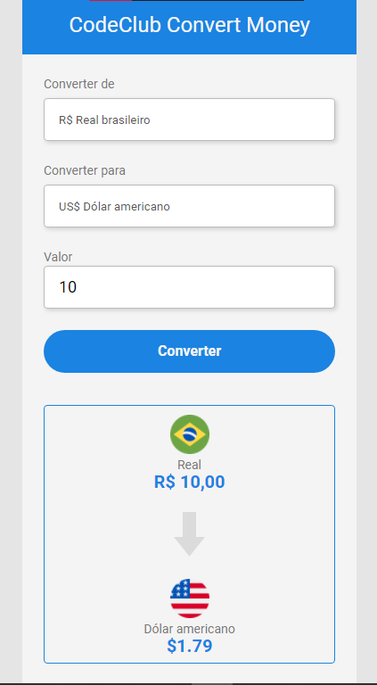

# CodeClub Convert Money
Converte de Real para Dólar, Euro ou Bitcoin. (O valor de cada o Dólar, Euro ou Bitcoin é do dia 26/11/21)

>Resultado do projeto: CodeClub Convert Money.

## 📋 Descrição

Projeto de converção de moedas, ele converte do Real para o Dólar, Euro e Bitcoin (todos com o preço do dia 26/11/21)

## 📜 Skills Utilizadas

<code></code> <code></code> <code></code>

## 👋 Feito por
<table>
  <tr>
    <td align="center">
      <a href="https://www.linkedin.com/in/franco-lenner-5622b7195/">
         
        
          <b>Franco Lenner</b>
        
      </a>
    </td>
  </tr>
</table>